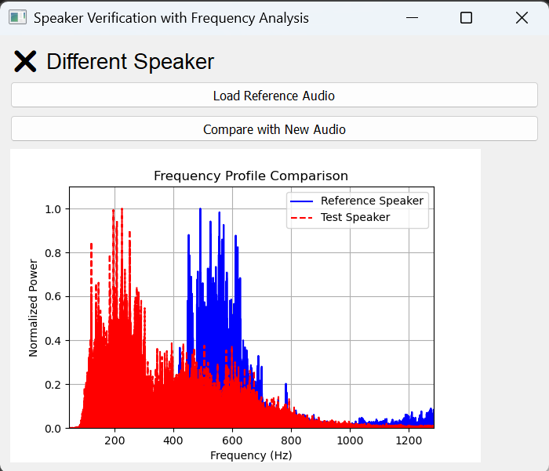

# 🔊 SoundHound – AI Speaker Verification & Visualization  

SoundHound is a powerful AI-driven speaker verification tool that not only identifies speakers but also visualizes their unique frequency spectrum! 🎤📊  

## 🚀 Features  
✅ **AI-Powered Speaker Verification** – Uses deep learning with SpeechBrain’s ECAPA-TDNN model for precise speaker recognition.  
✅ **Frequency Spectrum Visualization** – AI-driven analysis generates an image of the speaker’s unique frequency spectrum.  
✅ **User-Friendly Interface** – Interactive GUI for loading and comparing audio samples.  
✅ **MP3 & WAV Support** – Converts MP3 files to WAV for seamless processing.  
✅ **Optimized for Speed** – Leverages PyTorch and SpeechBrain for fast and efficient inference.  

## 🖼️ Speaker Spectrum Example  
When processing an audio sample, SoundHound generates a **frequency spectrum image** representing the unique voice characteristics of each speaker. This visualization is powered by deep learning models analyzing the audio’s frequency components.  

  

## 🎛️ How It Works  
1. **Load a reference audio file** 🎙️  
2. **Load a test audio file** 🎧  
3. **AI compares the voices** – See if they match & view the AI-generated spectrum visualization!  

## 🛠️ Installation  
```bash  
git clone https://github.com/YOUR_USERNAME/SoundHound.git  
cd SoundHound  
pip install -r requirements.txt  
```
Ensure **ffmpeg** is installed for audio processing:  
```bash  
sudo apt install ffmpeg  # Linux  
brew install ffmpeg  # macOS  
```
On Windows, download it from [FFmpeg official site](https://ffmpeg.org/download.html).  

## 🎯 Usage  
Run the program with:  
```bash  
python soundhound.py  
```
Follow the GUI prompts to load and compare audio files.  

## 🧠 Technologies Used  
- **SpeechBrain** – AI-powered speaker recognition  
- **PyTorch** – Deep learning framework  
- **Pydub** – Audio processing  
- **Matplotlib** – AI-based frequency spectrum visualization  
- **Tkinter** – GUI interface  

## 🤝 Contributing  
Want to improve SoundHound? Feel free to fork the repo, submit issues, or open a PR!  

## 📜 License  
MIT License – free to use and modify.  

